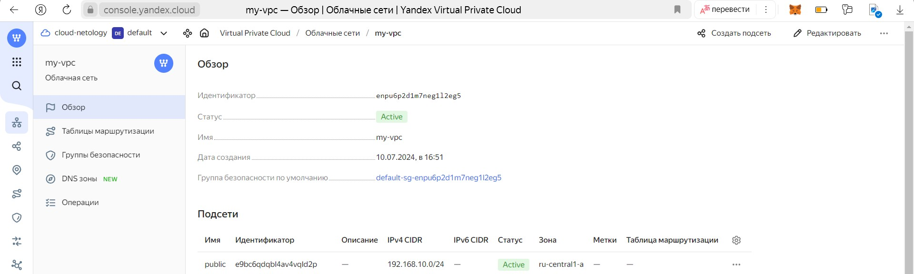
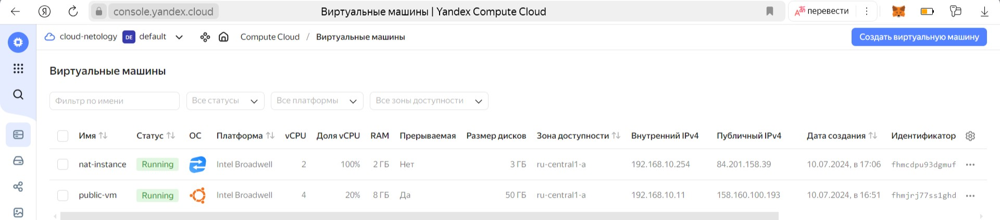
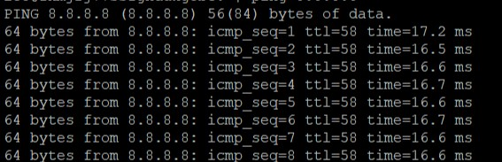

# Домашнее задание к занятию «Организация сети»

### Подготовка к выполнению задания

1. Домашнее задание состоит из обязательной части, которую нужно выполнить на провайдере Yandex Cloud, и дополнительной части в AWS (выполняется по желанию). 
2. Все домашние задания в блоке 15 связаны друг с другом и в конце представляют пример законченной инфраструктуры.  
3. Все задания нужно выполнить с помощью Terraform. Результатом выполненного домашнего задания будет код в репозитории. 
4. Перед началом работы настройте доступ к облачным ресурсам из Terraform, используя материалы прошлых лекций и домашнее задание по теме «Облачные провайдеры и синтаксис Terraform». Заранее выберите регион (в случае AWS) и зону.

---
### Задание 1. Yandex Cloud 

**Что нужно сделать**

1. Создать пустую VPC. Выбрать зону.
2. Публичная подсеть.

 - Создать в VPC subnet с названием public, сетью 192.168.10.0/24.
 - Создать в этой подсети NAT-инстанс, присвоив ему адрес 192.168.10.254. В качестве image_id использовать fd80mrhj8fl2oe87o4e1.
 - Создать в этой публичной подсети виртуалку с публичным IP, подключиться к ней и убедиться, что есть доступ к интернету.
3. Приватная подсеть.
 - Создать в VPC subnet с названием private, сетью 192.168.20.0/24.
 - Создать route table. Добавить статический маршрут, направляющий весь исходящий трафик private сети в NAT-инстанс.
 - Создать в этой приватной подсети виртуалку с внутренним IP, подключиться к ней через виртуалку, созданную ранее, и убедиться, что есть доступ к интернету.

Resource Terraform для Yandex Cloud:

- [VPC subnet](https://registry.terraform.io/providers/yandex-cloud/yandex/latest/docs/resources/vpc_subnet).
- [Route table](https://registry.terraform.io/providers/yandex-cloud/yandex/latest/docs/resources/vpc_route_table).
- [Compute Instance](https://registry.terraform.io/providers/yandex-cloud/yandex/latest/docs/resources/compute_instance).

---
### Задание 2. AWS* (задание со звёздочкой)

Это необязательное задание. Его выполнение не влияет на получение зачёта по домашней работе.

**Что нужно сделать**

1. Создать пустую VPC с подсетью 10.10.0.0/16.
2. Публичная подсеть.

 - Создать в VPC subnet с названием public, сетью 10.10.1.0/24.
 - Разрешить в этой subnet присвоение public IP по-умолчанию.
 - Создать Internet gateway.
 - Добавить в таблицу маршрутизации маршрут, направляющий весь исходящий трафик в Internet gateway.
 - Создать security group с разрешающими правилами на SSH и ICMP. Привязать эту security group на все, создаваемые в этом ДЗ, виртуалки.
 - Создать в этой подсети виртуалку и убедиться, что инстанс имеет публичный IP. Подключиться к ней, убедиться, что есть доступ к интернету.
 - Добавить NAT gateway в public subnet.
3. Приватная подсеть.
 - Создать в VPC subnet с названием private, сетью 10.10.2.0/24.
 - Создать отдельную таблицу маршрутизации и привязать её к private подсети.
 - Добавить Route, направляющий весь исходящий трафик private сети в NAT.
 - Создать виртуалку в приватной сети.
 - Подключиться к ней по SSH по приватному IP через виртуалку, созданную ранее в публичной подсети, и убедиться, что с виртуалки есть выход в интернет.

Resource Terraform:

1. [VPC](https://registry.terraform.io/providers/hashicorp/aws/latest/docs/resources/vpc).
1. [Subnet](https://registry.terraform.io/providers/hashicorp/aws/latest/docs/resources/subnet).
1. [Internet Gateway](https://registry.terraform.io/providers/hashicorp/aws/latest/docs/resources/internet_gateway).

# Выполнение:  

### Задание 1. Yandex Cloud 

**Что нужно сделать**

1. Создать пустую VPC. Выбрать зону.

Создаем пустую VPC  

  
```
resource "yandex_vpc_network" "my_vpc" {
  name = var.VPC_name
}
```

  

2. Публичная подсеть.

Создать в VPC subnet с названием public, сетью 192.168.10.0/24.
```
resource "yandex_vpc_subnet" "public_subnet" {
  name           = var.subnet_name
  v4_cidr_blocks = var.v4_cidr_blocks
  zone           = var.subnet_zone
  network_id     = yandex_vpc_network.my_vpc.id
}
```
Создать в этой подсети NAT-инстанс, присвоив ему адрес 192.168.10.254. В качестве image_id использовать fd80mrhj8fl2oe87o4e1.
```
resource "yandex_compute_instance" "nat_instance" {
  name = var.nat_name

  resources {
    cores  = var.nat_cores
    memory = var.nat_memory
  }

  boot_disk {
    initialize_params {
      image_id = var.nat_disk_image_id
    }
  }

  network_interface {
    subnet_id = yandex_vpc_subnet.public_subnet.id
    nat       = var.nat
    nat_ip_address = var.nat_primary_v4_address
  }

  metadata = {
    user-data = "${file("/home/winkel/clopro-homeworks/cloud-init.yaml")}"
  }
}
```

Создать в этой публичной подсети виртуалку с публичным IP, подключиться к ней и убедиться, что есть доступ к интернету.
```
resource "yandex_compute_instance" "public_vm" {
  name            = var.public_vm_name
  platform_id     = var.public_vm_platform
  resources {
    cores         = var.public_vm_core
    memory        = var.public_vm_memory
    core_fraction = var.public_vm_core_fraction
  }

  boot_disk {
    initialize_params {
      image_id = var.public_vm_image_id
      size     = var.public_vm_disk_size
    }
  }

  scheduling_policy {
    preemptible = var.scheduling_policy
  }

  network_interface {
    subnet_id = yandex_vpc_subnet.public_subnet.id
    nat       = var.nat
  }

  metadata = {
    user-data = "${file("/home/winkel/kuber-homeworks/3.2/terraform/cloud-init.yaml")}"
 }
}
```


```
terraform init
terraform plan
terraform apply
```
Проверяем, что все ресурсы успешно созданы




Проверяем доступ к интернету из созданной виртуальной машины
```
ssh winkel@158.160.100.193
ping 8.8.8.8
```



3. Приватная подсеть.

Создать в VPC subnet с названием private, сетью 192.168.20.0/24.
```tf
resource "yandex_vpc_subnet" "private_subnet" {
  name           = var.private_subnet_name
  v4_cidr_blocks = var.private_v4_cidr_blocks
  zone           = var.private_subnet_zone
  network_id     = yandex_vpc_network.my_vpc.id
}
```
Создать route table. Добавить статический маршрут, направляющий весь исходящий трафик private сети в NAT-инстанс.
```tf
resource "yandex_vpc_route_table" "private_route_table" {
  network_id = yandex_vpc_network.my_vpc.id

  static_route {
    destination_prefix = "0.0.0.0/0"
    next_hop_address   = var.nat_primary_v4_address
  }
}
```
Создать в этой приватной подсети виртуалку с внутренним IP, подключиться к ней через виртуалку, созданную ранее, и убедиться, что есть доступ к интернету.
```tf
resource "yandex_compute_instance" "private_vm" {
  name            = var.private_vm_name
  platform_id     = var.private_vm_platform

  resources {
    cores         = var.private_vm_core
    memory        = var.private_vm_memory
    core_fraction = var.private_vm_core_fraction
  }

  boot_disk {
    initialize_params {
      image_id = var.private_vm_image_id
      size     = var.private_vm_disk_size
    }
  }

  scheduling_policy {
    preemptible = var.private_scheduling_policy
  }

  network_interface {
    subnet_id = yandex_vpc_subnet.private_subnet.id
    nat       = false
  }

  metadata = {
    user-data = "${file("/home/winkel/kuber-homeworks/3.2/terraform/cloud-init.yaml")}"
 }
}
```

Проверяем созданные ресурсы:


Провереям доступ к интернету c privat-vm, но напрямую мы на нее попасть не можем, так как у нее отсутствует внешний ip. Следовательно перейдем на public_vm, предварительно скопировав туда ssh ключи
```
scp ~/.ssh/id_rsa.pub winkel@178.154.226.175:~/.ssh/id_rsa.pub
scp ~/.ssh/id_rsa winkel@178.154.226.175:~/.ssh/id_rsa
ssh -i winkel@178.154.226.175
```
Подключаемся на privat-vm и проверяем доступ в сеть
```
ssh -i /home/winkel/.ssh/id_rsa winkel@192.168.20.10
ping 8.8.8.8
```


Доступ в интернет отсвутствет. Проблема в том, что для привязки таблицы маршрутизации к подсети в Terraform, необходимо добавить route_table_id в ресурс yandex_vpc_subnet, который будет ссылаться на идентификатор созданной таблицы маршрутизации (добавляем строку ` route_table_id = yandex_vpc_route_table.private_route_table.id` в конфигурацию приватной подсети).
```tf
resource "yandex_vpc_subnet" "private_subnet" {
  name           = var.private_subnet_name
  v4_cidr_blocks = var.private_v4_cidr_blocks
  zone           = var.private_subnet_zone
  network_id     = yandex_vpc_network.my_vpc.id
  route_table_id = yandex_vpc_route_table.private_route_table.id
}
```

Далее повторяем попытку выхода в сеть с private-vm


Далее прилагаю полный файл манифеста [main.tf](https://github.com/LeonidKhoroshev/clopro-homeworks/blob/hw-15.1/main.tf)

Также прилагаю файл с перемеными [variables.tf](https://github.com/LeonidKhoroshev/clopro-homeworks/blob/hw-15.1/variables.tf)

---
