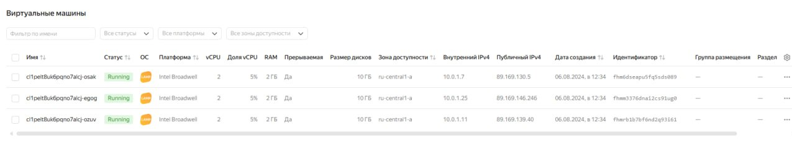
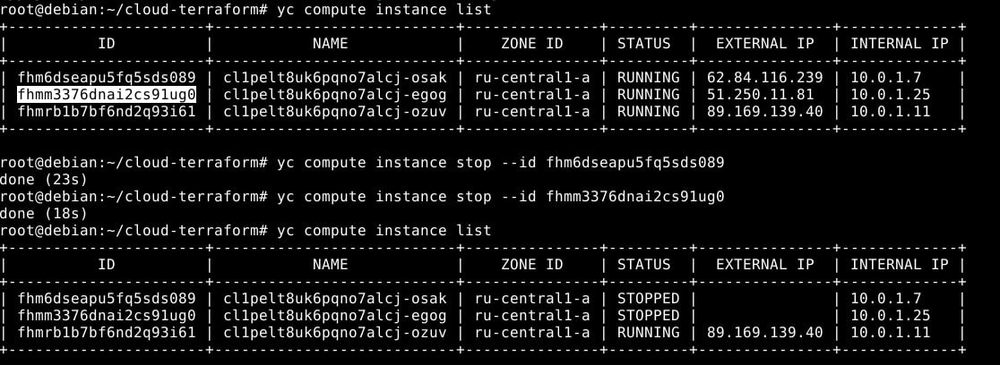

# Домашнее задание к занятию «Вычислительные мощности. Балансировщики нагрузки»., Лебедев А.И., FOPS-10

### Подготовка к выполнению задания

1. Домашнее задание состоит из обязательной части, которую нужно выполнить на провайдере Yandex Cloud, и дополнительной части в AWS (выполняется по желанию). 
2. Все домашние задания в блоке 15 связаны друг с другом и в конце представляют пример законченной инфраструктуры.  
3. Все задания нужно выполнить с помощью Terraform. Результатом выполненного домашнего задания будет код в репозитории. 
4. Перед началом работы настройте доступ к облачным ресурсам из Terraform, используя материалы прошлых лекций и домашних заданий.

---
## Задание 1. Yandex Cloud 

**Что нужно сделать**

1. Создать бакет Object Storage и разместить в нём файл с картинкой:

 - Создать бакет в Object Storage с произвольным именем (например, _имя_студента_дата_).
 - Положить в бакет файл с картинкой.
 - Сделать файл доступным из интернета.
 
2. Создать группу ВМ в public подсети фиксированного размера с шаблоном LAMP и веб-страницей, содержащей ссылку на картинку из бакета:

 - Создать Instance Group с тремя ВМ и шаблоном LAMP. Для LAMP рекомендуется использовать `image_id = fd827b91d99psvq5fjit`.
 - Для создания стартовой веб-страницы рекомендуется использовать раздел `user_data` в [meta_data](https://cloud.yandex.ru/docs/compute/concepts/vm-metadata).
 - Разместить в стартовой веб-странице шаблонной ВМ ссылку на картинку из бакета.
 - Настроить проверку состояния ВМ.
 
3. Подключить группу к сетевому балансировщику:

 - Создать сетевой балансировщик.
 - Проверить работоспособность, удалив одну или несколько ВМ.
4. (дополнительно)* Создать Application Load Balancer с использованием Instance group и проверкой состояния.

Полезные документы:

- [Compute instance group](https://registry.terraform.io/providers/yandex-cloud/yandex/latest/docs/resources/compute_instance_group).
- [Network Load Balancer](https://registry.terraform.io/providers/yandex-cloud/yandex/latest/docs/resources/lb_network_load_balancer).
- [Группа ВМ с сетевым балансировщиком](https://cloud.yandex.ru/docs/compute/operations/instance-groups/create-with-balancer).

---  

## Выполнение:  

- Создадим файл **bucket.tf**. Так как я немного перегнал и выполнил задачу 15.3 ранее, чем 15.2 - используем наш чуть модернизрованный, уже созданный файл  [bucket.tf](tf/bucket.tf)

- Создадим нашу **LAMP**-группу из трех серверов:

```
variable "yandex_compute_instance_groupvms" {
  type        = list(object({
    name = string
    cores = number
    memory = number
    core_fraction = number
    platform_id = string
  }))

  default = [{
      name = "lamp-group"
      cores         = 2
      memory        = 2
      core_fraction = 5
      platform_id = "standard-v1"
    }]
}

variable "boot_disk" {
  type        = list(object({
    size = number
    type = string
    image_id = string
    }))
    default = [ {
    size = 10
    type = "network-hdd"
    image_id = "fd827b91d99psvq5fjit"
  }]
}

resource "yandex_iam_service_account" "groupvm-sa" {
  name        = "groupvm-sa"
  description = "Сервисный аккаунт для управления группой ВМ."
}

resource "yandex_resourcemanager_folder_iam_member" "group-editor" {
  folder_id  = var.folder_id
  role       = "editor"
  member     = "serviceAccount:${yandex_iam_service_account.groupvm-sa.id}"
  depends_on = [
    yandex_iam_service_account.groupvm-sa,
  ]
}

resource "yandex_compute_instance_group" "group-vms" {
  name                = var.yandex_compute_instance_groupvms[0].name
  folder_id           = var.folder_id
  service_account_id  = "${yandex_iam_service_account.groupvm-sa.id}"
  deletion_protection = "false"
  depends_on          = [yandex_resourcemanager_folder_iam_member.group-editor]
  instance_template {
    platform_id = var.yandex_compute_instance_groupvms[0].platform_id
    resources {
      memory = var.yandex_compute_instance_groupvms[0].memory
      cores  = var.yandex_compute_instance_groupvms[0].cores
      core_fraction = var.yandex_compute_instance_groupvms[0].core_fraction
    }

  boot_disk {
    initialize_params {
      image_id = var.boot_disk[0].image_id
      type     = var.boot_disk[0].type
      size     = var.boot_disk[0].size
    }
  }

    network_interface {
      network_id         = "${yandex_vpc_network.develop.id}"
      subnet_ids         = ["${yandex_vpc_subnet.public.id}"]
      nat = true
    }

  scheduling_policy {
    preemptible = true
  }

    metadata = {
    ssh-keys = "ubuntu:${local.ssh-keys}"
    serial-port-enable = "1"
    user-data  = <<EOF
#!/bin/bash
cd /var/www/html
echo '<html><head><title>Hello World</title></head> <body><h1>Here is my netology LAMP</h1></body></html>' > index.html
EOF
    }
  }

  scale_policy {
    fixed_scale {
      size = 3
    }
  }

  allocation_policy {
    zones = [var.default_zone]
  }

  deploy_policy {
    max_unavailable = 1
    max_expansion   = 0
  }

  health_check {
    interval = 60
    timeout  = 10
    tcp_options {
      port = 80
    }
  }

    load_balancer {
        target_group_name = "lamp-group"
    }
}
```



 - Создадим балансировщик:

```
resource "yandex_lb_network_load_balancer" "network-balancer" {
  name = "lamp-balancer"
  deletion_protection = "false"
  listener {
    name = "http-check"
    port = 80
    external_address_spec {
      ip_version = "ipv4"
    }
  }
  attached_target_group {
    target_group_id = yandex_compute_instance_group.group-vms.load_balancer[0].target_group_id
    healthcheck {
      name = "http"
      interval = 2
      timeout = 1
      unhealthy_threshold = 2
      healthy_threshold = 5
      http_options {
        port = 80
        path = "/"
      }
    }
  }
}
```

  

- Обращаемся уже к нашему балансировщику:

  

 - Остановим несколько сервисов из группы и снова обратимся к балансировщику:

    

    

---


