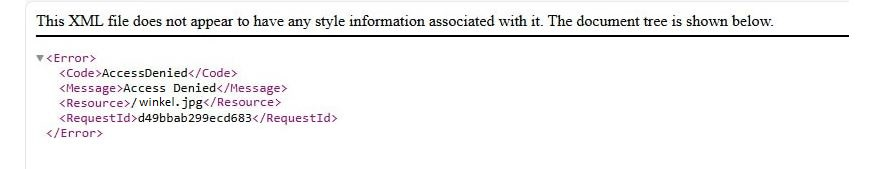

# Домашнее задание к занятию «Безопасность в облачных провайдерах», Лебедев А.И., FOPS-10

Используя конфигурации, выполненные в рамках предыдущих домашних заданий, нужно добавить возможность шифрования бакета.

---
## Задание 1. Yandex Cloud   

1. С помощью ключа в KMS необходимо зашифровать содержимое бакета:

 - создать ключ в KMS;
 - с помощью ключа зашифровать содержимое бакета, созданного ранее.
2. (Выполняется не в Terraform)* Создать статический сайт в Object Storage c собственным публичным адресом и сделать доступным по HTTPS:

 - создать сертификат;
 - создать статическую страницу в Object Storage и применить сертификат HTTPS;
 - в качестве результата предоставить скриншот на страницу с сертификатом в заголовке (замочек).

Полезные документы:

- [Настройка HTTPS статичного сайта](https://cloud.yandex.ru/docs/storage/operations/hosting/certificate).
- [Object Storage bucket](https://registry.terraform.io/providers/yandex-cloud/yandex/latest/docs/resources/storage_bucket).
- [KMS key](https://registry.terraform.io/providers/yandex-cloud/yandex/latest/docs/resources/kms_symmetric_key).

---  

 ### Выполнение:  

- Оставляем терраформ-конструкции из первого задания без изменений и описываем конструкцию в файле **bucket.tf**. Можно было бы все описать в одном файле, но, думаю, лучше описывать по отдельности, чтобы не запутаться. Собственно, **bucket.tf**:

```
locals {
    current_timestamp = timestamp()
    date = formatdate("DD-MM-YYYY", local.current_timestamp)
    bucket_name = "lebedevai-${local.date}"
}

// сервисный аккаунт
resource "yandex_iam_service_account" "service" {
  folder_id = var.folder_id
  name      = "bucket-sa"
}

// роли для сервисного аккаунта
resource "yandex_resourcemanager_folder_iam_member" "bucket-editor" {
  folder_id = var.folder_id
  role      = "storage.editor"
  member    = "serviceAccount:${yandex_iam_service_account.service.id}"
  depends_on = [yandex_iam_service_account.service]
}

resource "yandex_resourcemanager_folder_iam_member" "sa-editor-encrypter-decrypter" {
  folder_id = var.folder_id
  role      = "kms.keys.encrypterDecrypter"
  member    = "serviceAccount:${yandex_iam_service_account.service.id}"
}

// статический ключ
resource "yandex_iam_service_account_static_access_key" "sa-static-key" {
  service_account_id = yandex_iam_service_account.service.id
  description        = "static access key for object storage"
}

resource "yandex_storage_bucket" "lebedevai" {
  access_key = yandex_iam_service_account_static_access_key.sa-static-key.access_key
  secret_key = yandex_iam_service_account_static_access_key.sa-static-key.secret_key
  bucket = local.bucket_name
  acl    = "public-read"
  server_side_encryption_configuration {
    rule {
      apply_server_side_encryption_by_default {
        kms_master_key_id = yandex_kms_symmetric_key.key-a.id
        sse_algorithm     = "aws:kms"
      }
    }
  }
}

resource "yandex_storage_object" "winkel" {
  access_key = yandex_iam_service_account_static_access_key.sa-static-key.access_key
  secret_key = yandex_iam_service_account_static_access_key.sa-static-key.secret_key
  bucket = local.bucket_name
  key    = "winkel.jpg"
  source = "~/winkel.jpg"
  acl = "public-read"
  depends_on = [yandex_storage_bucket.lebedevai]
}

resource "yandex_kms_symmetric_key" "key-a" {
  name              = "key-a"
  default_algorithm = "AES_256"
  rotation_period   = "168h"
}
```

- Пытаемся достучаться до нашего баккета:

  

---


